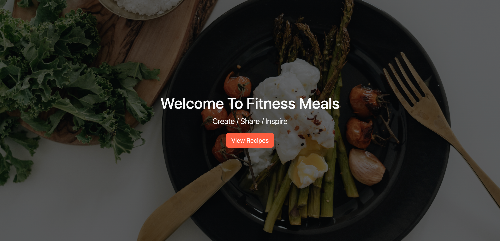
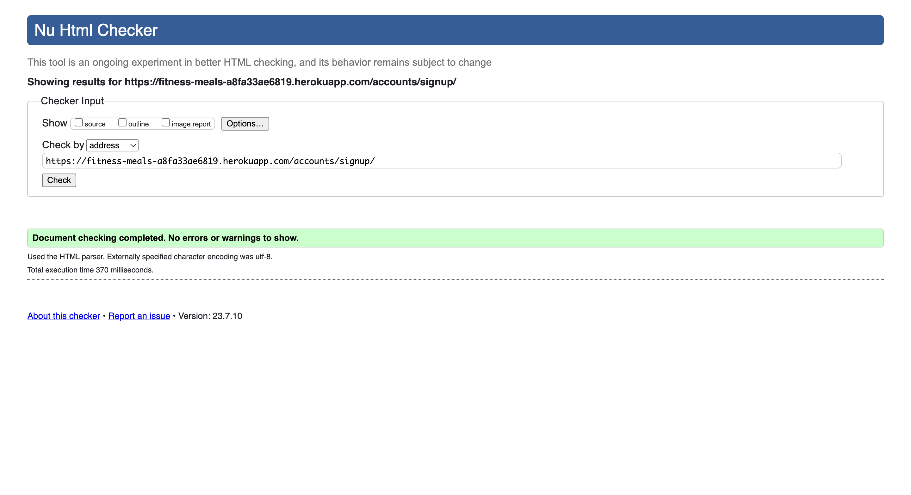

# Fitness Meals

## Content
- [UX](#ux)
  - [Project Description](#project-description)
  - [Project Goals](#project-goals)
  - [User Stories](#user-stories)
  - [Design](#design)
    - [ERD Database](#erd-database)
    - [Wireframes](#wireframes)
    - [Colour Palette](#colour-palette)
-  [Features](#features)
    -  [Navbar](#navbar)
    -  [Home Page](#home-page)
    -  [Footer](#footer)
    -  [Recipes Page](#recipes)
    -  [Recipe Detail Page](#recipe-detail-page)
    -  [Register Page](#register-page)
    -  [Sign In Page](#sign-in-page)
    -  [Sign Out Page](#sign-out-page)
    -  [Profile Page](#profile-page)
    -  [Recipe Edit](#recipe-edit)
    -  [Recipe Delete](#recipe-delete)
-  [Technologies Used](#technologies-used)
    -  [Languages](#languages)
    -  [Frameworks and Programs](#frameworks-and-programs)
- [Tests](#tests)
  - [Validation](#validation)
    - [HTML Validation](#html-validation)
    - [CSS Validation](#css-validation)
    - [Python Validation](#python-validation)
      - [recipes](#recipes)
      - [fitness_meals](#fitness-meals)
  - [Bugs](#bugs)
    - [Solved Bugs](#solved-bugs)
- [Deployment](#deployment)
  - [How To Clone](#how-to-clone)
  - [How To Fork](#how-to-fork)
  - [Database](#database)
  - [Cloudinary](#cloudinary)
  - [Heroku](#heroku)
  - [IDE](#ide)
- [Credits](#credits)
  - [Code Used](#code-used)
  - [Content](#content)
  - [Media](#media)

## UX

### Project Description

Fitness Meals is an application that lets users share healthy recipes. Registered users can create and share recipes and engage with other members by liking and commenting on their recipes. Unregistered users will only be able to view recipes but need to register to use the full features of the application. Fitness Meals is built with the Django Python framework using the Agile methodology to plan the project.

### Project Goals

1. Create a user-friendly application with a visually pleasing design
2. Make sure the website is fully responsive to fit all screen sizes
3. View a list of member's shared recipes on a pagination pages
4. Implement user registration and login so authentic users can create and share their recipes and also like and comment on other member's recipes
5. Deploy the application making sure the site has excellent performance and accessibility

### User Stories

- As a User, I can view the home page so that I can learn about the application
- As a User, I can register an account so that I can create and share my recipes
- As a User, I can log in so that I can use the application's full functionality
- As a user, I can log out so that I can keep my account secure
- As a User, I can create a new recipe so that I can share it with other users
- As a User, I can edit recipes so that I can change recipe details
- As a User, I can delete my recipes so that I can remove the recipe from the application
- As a User, I can view a list of shared recipes so that I can get inspiration from other user's recipes
- As a User, I can view the recipe so that I can see the recipe's full details
- As a User, I can comment on members' recipes so that I ask questions about the recipe
- As a User, I can like or unlike recipes so that I can support the other users
- As a User, I can see my profile page so that I can see my recipes

## Design

### ERD Database


### Wireframes

<details>
  <summary>Home Page</summary>
  
  
</details>

<details>
  <summary>Recipes Page</summary>
  
  
</details>

<details>
  <summary>Recipe Detail Page</summary>
  
  
</details>

<details>
  <summary>Sign Up Page</summary>
  
  
</details>

<details>
  <summary>Login Page</summary>
  
  
</details>

<details>
  <summary>Create Recipe Page</summary>
  
  
</details>

<details>
  <summary>Edit Recipe Page</summary>
  
  
</details>

### Colour Palette 
The project's colour palette is straightforward. Due to the potential for several colours in food-related photographs, the UI may become confusing. The colour palette was generated by [Coolors](https://coolors.co/).


## Features

### Navbar
The navbar is featured throughout the whole website. If a user is unregistered it will show different navigation links than registered users. 

##### Navbar Unregistered Users</summary>
  
The navbar contains the logo and navigation links to the Home, Recipes, Login, and Register pages.

##### Navbar Registered Users</summary>

The navbar contains the logo and navigation links to the Profile, Recipes, Logout, and Create Recipe pages.

### Home Page
The home page gives an introductory information to the user. If the user is registered, there won't be any links to go back to the home page.

#### Hero Section

The hero section contains a welcome message and a link to the recipes page.

#### About Section

The hero section contains a healthy recipe image and an about paragraph. There is a link for the user to register.

#### Recent Recipes Section

The Recent Recipes section contains three cards for the three recently created recipes.

### Footer

The footer contains the Fitness Meals logo and social links to my accounts.

### Recipes Page

The Recipes page shows all published recipes. The recently created recipes will appear at the top.

### Recipe Detail Page

#### Recipe Information 

The recipe heading gives users information about the recipe


If the user shared the recipe they will get the functionality to Edit or delete the recipe.

#### Additional Recipe Information 


#### Ingredients and Method

There is two columns with what ingredients the user will need and what steps to create the recipe.

#### Likes and Comments Count

The user will see how many likes and comments are left on the recipe.


If the user is login they have the ability to like or unlike the recipe.

#### Comments

Comments section will show approved user comments.


If the user is registered they have the ability to leave a comment

### Register Page

Register page, the user must make an unique username and a strong password.

### Sign In Page


### Sign Out Page


### Profile Page

The user has a profile page where they can see their drafted and published recipes.

### Recipe Edit
<details>
  <summary>Recipe Edit</summary>
  
  
</details>
The user can edit their recipe all the recipe information is already prepopulated.

### Recipe Delete


## Technologies Used

### Languages:
- Python
- HTML
- CSS
- JavaScript

### Frameworks and Programs:
- [Django](https://www.djangoproject.com/) - used as the framework
- [ElephantSQl](https://www.elephantsql.com/) - used to store project data
- [Cloudinary](https://cloudinary.com/) - used to store media and static files
- [GitPod](https://www.gitpod.io/) - used to development the website
- [Heroku](https://www.heroku.com/) - used to deploy the project
- [git](https://git-scm.com/) - used for version control
- [GitHub](https://github.com/) - used to store code
- [Font Awesome](https://fontawesome.com/) - used to create ERD
- [Bootstrap 5](https://getbootstrap.com/) - used for layout and styling
- [Figma](https://www.figma.com/) - used to create project wireframes
- [LucidChart](https://www.lucidchart.com/pages/) - used to create ERD
- [Favicon](https://favicon.io/) - used to generate favicon
- [Coolors](https://coolors.co/) - used to generate colour palette 

## Tests

## Validation

### HTML Validation
HTML code was tested using [W3C Validator](https://validator.w3.org/nu/)

<details>
  <summary>index.html - Result</summary>
  
  
</details>

<details>
  <summary>recipes_list.html - Result</summary>
  
  
</details>

<details>
  <summary>recipes_list.html - Result</summary>
  
  
</details>

<details>
  <summary>recipes_detail.html - Result</summary>
  
  
</details>

<details>
  <summary>signup.html - Result</summary>
  
  
</details>

<details>
  <summary>login.html - Result</summary>
  
  
</details>

<details>
  <summary>logout.html - Result</summary>
  
  
</details>

<details>
  <summary>recipe_create.html - Result</summary>
  
  
</details>

<details>
  <summary>recipe_edit.html - Result</summary>
  
  
</details>

<details>
  <summary>recipe_delete.html - Result</summary>
  
  
</details>

<details>
  <summary>profile.html - Result</summary>
  
  
</details>

### CSS Validation
CSS code was tested using [jigsaw](https://jigsaw.w3.org/css-validator/)
<details>
  <summary> style.css - Result</summary>
  
  
</details>

### Python Validation
Python was tested using [Pep8ci](https://pep8ci.herokuapp.com/), Code Institute Python Linter.

#### Recipes

<details>
  <summary>admin.py - Result</summary>
  
</details>

<details>
  <summary>app.js - Result</summary>
  
  
</details>

<details>
  <summary>forms.js - Result</summary>
  
  
</details>

<details>
  <summary>models.js - Result</summary>
  
  
</details>

<details>
  <summary>urls.js - Result</summary>
  
  
</details>

<details>
  <summary>views.py - Result</summary>
  
  
</details>

#### fittness_meals

<details>
  <summary>settings.py - Result</summary>
  
  
</details>

<details>
  <summary>urls.py - Result</summary>
  
  
</details>

#### manage.py

<details>
  <summary>manage.py - Result</summary>
  
  
</details>

### Lighouse Testing

<details>
  <summary>Home Page - Result</summary>
  
  
</details>

<details>
  <summary>Recipes Page - Result</summary>
  
  
</details>

<details>
  <summary>Recipes Detail Page - Result</summary>
  
  
</details>

<details>
  <summary>Sign Up Page - Result</summary>
  
  
</details>

<details>
  <summary>Sign In Page - Result</summary>
  
  
</details>

<details>
  <summary>Logout Page - Result</summary>
  
  
</details>

<details>
  <summary>Create Recipe Page - Result</summary>
  
  
</details>

<details>
  <summary>Edit Recipe Page - Result</summary>
  
  
</details>

<details>
  <summary>Delete Recipe Page - Result</summary>
  
  
</details>

<details>
  <summary>Profile Page - Result</summary>
  
  
</details>

### Bugs

#### Solved Bugs

| Bug                                                                                 | Error Message   | Solution                                                                            |
| ----------------------------------------------------------------------------------- | --------------- | ----------------------------------------------------------------------------------- |
| When deploying the project to Heroku, I got an error when viewing the uploaded site. | Disallowed Host | In settings.py, I changed the value of ALLOWED_HOSTS to my right Heroku project URL. 
| When liking a recipe, I got brought to the ERROR 405 page instead of being redirected to the recipe_detail page. | ERROR 405 | I made a mistake in the RecipeLike view. Although I named my variable post, the correct name was the recipe.  
| When I wanted to create a draft recipe I was getting a 404 error. | ERROR 404 | The RecipeDetail view was only filtering through published recipes, not drafts. I added an extra filter for draft recipes.

## Deployment

### How to Clone
1. Open up a terminal
2. Change to the directory where you want the location of the cloned depository 
3. Copy the code below and paste it into the terminal:
```console
git clone https://github.com/EdwardShanahan07/fitness-meals.git
```
4. Hit the enter key to clone the repository

### How to Fork
1. Login or signup to Github
2. Search for this repository: [EdwardShanahan07/fitness-meals](https://github.com/EdwardShanahan07/fitness-meals)
3. Ont the top right corner, click Fork

### Database

1. Register or log in to [ElephantSQL](https://www.elephantsql.com/)
2. At the home page click the "Create New Instance" button
3. Name your database (fitness_meals)
4. Select the free plan "Tiny Turtle"
5. Click the "Select Region" Button
6. Select your "data centre"
7. Click the "Review" Button
8. Click the "Create Instance" button
9. Click into the new instance, and copy the database URL (You need this URL for Heroku Variable later)

### Cloudinary

1. Register or log in to [Cloudinary](https://cloudinary.com/)
2. Open the dashboard tab
3. Copy API Environment Variable (When pasting the variable make sure to remove "CLOUDINARY_URL=" at the start of the varibale)

### Heroku

1. Register or log in to [Heroku](https://www.heroku.com/)
2. Click the "New" button and select "Create new app"
3. Name your app name
4. Select your region
5. Open the settings tab, and click the "Reval Config Vars"
6. Add DATABASE_URL to Config Vars and use your database URL as the value
7. Add SECRET_KEY to Config Vars and use your secret key
8. Add CLOUDINARY_URL to Config Vars and use your Cloudinary API Environment Variable
9. Select the Deploy tab, choose GitHub as your deployment method
10. Search for the project repo and connect
11. Deploy from the main branch to publish

## IDE

1. Create an env.py file
2. Import the os module, add DATABASE_URL and paste the database key

```
import os

os.es.environ["DATABASE_URL"] = "DATABASE URL"
```

3. Add your Django secret key to the env.py file, and cut the SECRET_KEY from
   the settings.py file (If the SECRET_KEY doesn't exist create your own)

```
os.es.environ["SECRET_KEY"] = "SECRET KEY"
```

4. Add your CLOUDINARY variable, copy your Cloudinary API Variable key from the website

```
os.es.environ["CLOUDINARY_URL"] = "CLODINARY API KEY"
```

## Credits

### Code Used

- Project code is based on the Code Institue Walkthrough project, "I Think Therefor I Blog".
  [Walkthrough Project](https://github.com/Code-Institute-Solutions/Django3blog/tree/master/12_final_deployment)

### Content

- Recipes content is from [MyProtein](https://www.myprotein.ie/blog/recipe/healthy-breakfast-burrito/)
- Favicon: [Salad icons created by smalllikeart - Flaticon](https://www.flaticon.com/free-icons/salad)

### Media

- Images gathered from [Pexels](https://www.pexels.com/)
